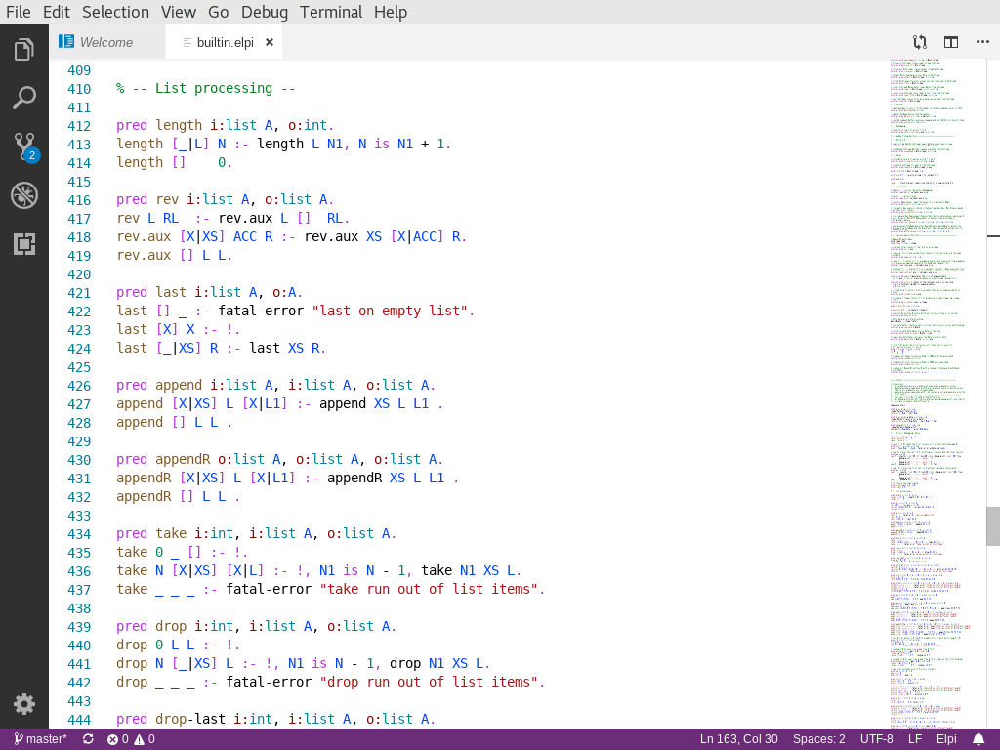

# elpi-lang

This extension provides some basic support for the [Elpi](https://github.com/LPCIC/elpi)
programming language to Visual Studio Code.

## Features

- Basic syntax highlighting

  

## Requirements

- none

## Extension Settings

- none

## Known Issues

- none

## Release Notes

### 0.0.1

First public release