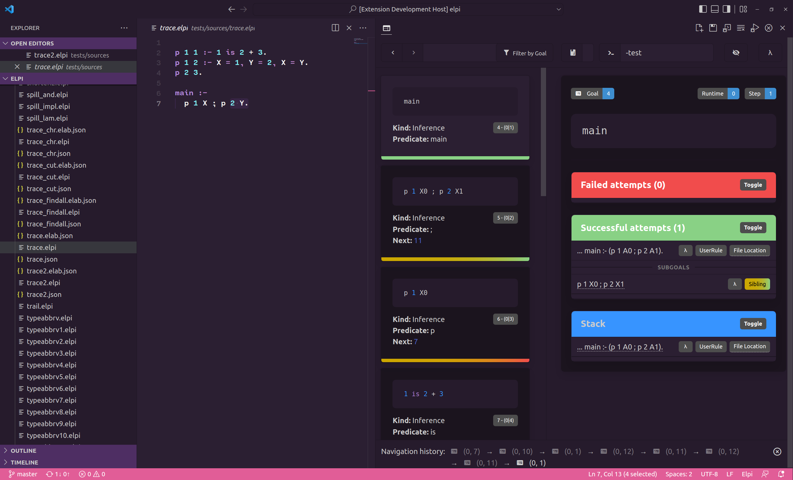

# elpi-lang

This extension provides support for the [Elpi](https://github.com/LPCIC/elpi) programming language to Visual Studio Code.

## Features

- Basic syntax highlighting
- Trace visualisation and navigation

## Requirements

- Node 1.16+
- VSCode 1.49+
- Elpi 1.16+

## Building for development

- `npm install`

## Running in development

- Open the source tree root in VS Code 1.49+
- Go to the extension panel in activity bar
- Click 'Run extension'

## Extension Settings

- none

## Known Issues

- none

## Release Notes

### 0.2.2

- Fallback to npm for all dependencies
- Use minified assets exclusively
- Introspect presence of required binaries in PATH

### 0.2.1

- Make the highlighting optional when browsing the trace

### 0.2.0

- Adds trace visualisation

### 0.0.1

- First public release
- Syntax highlighting
